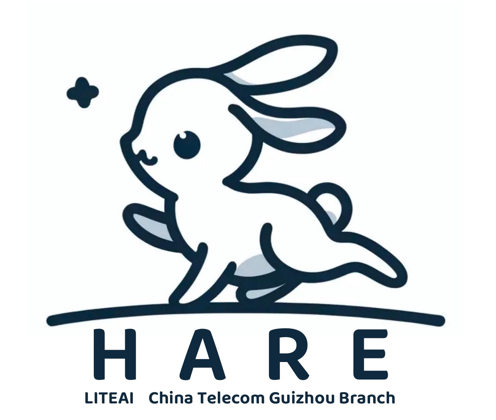

<div align="center">



# HARE

中文 ｜ [English](./README-en.md)
<p align="center">
    🤗 <a href="https://huggingface.co/LiteAI-Team/Hare-1.1B-base">Hugging Face</a> | 🤖 <a href="https://modelscope.cn/models/LiteAITeam/Hare-1.1B-base">ModelScope</a> | 📃 <a href="https://liteai-team.notion.site/HARE-HumAn-pRiors-a-key-to-small-language-model-Efficiency-a285280a3c61491ab142cc718f84aa7d?pvs=25">Technical Report</a> 
</p>
<!-- | 📑 <a href="">ArXiv</a> -->
</div>

<!-- Introduction -->
## 简介

HARE 是由中国电信股份有限公司贵州分公司 LiteAI 团队开发的预训练模型，我们使用约600B Tokens的高质量开源和策略生成的合成数据作为预训练数据。模型大小仅有1.1B，并在Open LLM Leaderboard上取得不错的成绩。
 - 我们选取 Mistral 作为基础架构，复用其分词器，并修改模型参数使得模型大小缩小到1.1B。
 - 我们模型遵循 Mistral 基础架构，因此，可以直接应用在许多支持 Mistral 的开源项目中，如 vLLM 等。
 - 我们模型的参数量仅为11亿，因此，我们可以将模型部署到消费级显卡、手机端等成本较低的设备上。
 - 我们对照 [Octopus](https://huggingface.co/NexaAIDev/Octopus-v2) 的工作，尝试并成功复现了其工作。
 - 我们探索了FP8精度下的高效训练，并总结了一份最佳实践，希望能为开源社区LLM训练作出力所能及的贡献。
 - 我们正在研发与适配中文。

我们的源代码遵循 Apache 2.0 进行开源。对于我们的模型，由于我们仅用于学术性质的研究，因此无法保证模型生成内容的准确性，请您在使用前悉知。

#### 快速导航

[更新日志](#update_log) | [模型地址](#model_link) | [评测结果](#evaluation) | [快速使用](#quick_start) | [二次开发](#continue_train) | [工具调用实践](#tool_calling) | [联系我们](#contact_us) 

<!-- 更新日志 -->
<p id="update_log"></p>

<!-- TODO -->
## 更新日志
 - **2024-06-05 开源 [HARE-1.1B-base](https://huggingface.co/LiteAI-Team/Hare-1.1B-base)、[HARE-1.1B-chat]() 和工具调用实践 [HARE-1.1B-tool]()，您可以在[这里](https://liteai-team.notion.site/HARE-HumAn-pRiors-a-key-to-small-language-model-Efficiency-a285280a3c61491ab142cc718f84aa7d?pvs=25)阅读我们的技术报告。**

<!-- 模型地址 -->
<p id="model_link"></p>

## 模型地址

我们的模型参数及训练细节如下：

| Setting | Description |
|:---:|:---:|
|Size|1.1B|
|Model structure|Mistral|
|Model settings| Hidden size:2048, Hidden layers:22, KV heads:8, Attention heads:32|
|Batch size|2M|
|Training tokens| ~ 600B|
|Training sequence length|2048|
|Learning Rate|5e-4|
|Hardware| 16 H800-80G GPUs|

**您可以前往HuggingFace或是ModelScope下载和体验我们的模型：**

<!-- TODO -->
|      | HuggingFace | ModelScope |
|:-----|:--------|:-------|
|Base|[HARE-1.1B-base](https://huggingface.co/LiteAI-Team/Hare-1.1B-base)|[HARE-1.1B-base](https://modelscope.cn/models/LiteAITeam/Hare-1.1B-base)|
|Chat|[HARE-1.1B-chat]()|[HARE-1.1B-chat]()|
|Tool demo|[HARE-1.1B-tool]()|[HARE-1.1B-tool]()|

**我们将在不久后开源中文版本。**

<!-- 评测结果 -->
<p id="evaluation"></p>

## 评测结果

HARE 采取将开源高质量预训练数据和策略生成数据混合训练的方式，在有限的训练资源和少量预训练Tokens下，在Open LLM Leaderboard的轻量级模型（参数量小于2B）中，取得了优异的成绩。

|Model|Size|avg|MMLU|ARC-C|TruthfulQA 0-shot|Winogrande5-shot|Hellaswag 10-shot|GSM8K 5-shot|
|:---:|:---:|:---:|:---:|:---:|:---:|:---:|:---:|:---:|
||||5-shot|25-shot|0-shot|5-shot|10-shot|5-shot|
|phi-1_5|1.3B|47.69|43.89|52.9|40.89|72.22|63.79|12.43|
|Qwen-1.5|1.8B|46.55|46.71|37.88|39.43|60.3|61.42|33.59| 
|stablelm-2|1.6B|45.25|38.95|43.34|36.78|64.56|70.45|17.44| 
|__Hare__|1.1B|40.17|35.74|38.4|42.08|59.27|57.46|8.04|
|H2o-danube|1.8B|39.12|25.94|39.42|33.86|64.48|69.58|1.44|
|OpenELM|1.1B|38.47|27.05|36.69|33.86|63.22|65.71|1.21|
|csg-wukong|1B|37.78|25.33|37.71|42.79|56.67|58.93|5.23|
|TinyLlama-3T|1.1B|36.42|26.04|33.87|37.32|59.51|60.31|1.44|

同时，我们针对 benchmark 数据泄漏问题做了探索与实验，详细分析请参考我们的技术报告 [HARE](https://liteai-team.notion.site/HARE-HumAn-pRiors-a-key-to-small-language-model-Efficiency-a285280a3c61491ab142cc718f84aa7d?pvs=25) 。

同样地，我们也对SFT后的模型进行评测，结果如下：

|Model|Size|avg|MMLU|ARC-C|TruthfulQA 0-shot|Winogrande5-shot|Hellaswag 10-shot|GSM8K 5-shot|
|:---:|:---:|:---:|:---:|:---:|:---:|:---:|:---:|:---:|
||||5-shot|25-shot|0-shot|5-shot|10-shot|5-shot|
|__Hare__|1.1B|40.00|33.62|37.46|41.49|58.88|53.03|15.54|
|Qwen-1.5|1.8B|43.99|45.87|38.74|40.62|59.67|60.02|19.03| 
|stablelm-2|1.6B|50.71|41.47|43.52|46.50|64.72|69.24|38.32|
|TinyLlama|1.1B|36.26|26.22|33.53|36.79|60.22|59.38|1.44|
|cosmo|1.8B|36.59|26.69|38.57|38.15|55.49|55.13|5.53|


您也可以在 [Open LLM Leaderboard](https://huggingface.co/spaces/open-llm-leaderboard/open_llm_leaderboard) 查看评测排名。

<!-- 快速使用 -->
<p id="quick_start"></p>

## 快速使用

以下是一些使用示例，您可以参考这些代码来快速加载并体验我们的模型。

在开始前，请您确保已经安装必要的依赖库：
```Shell
pip install -r requirements.txt
```

您也可以安装 [flash-attention](https://github.com/Dao-AILab/flash-attention) 来加速模型推理和降低显存占用。


### Transformers 加载和使用

```python
import torch
from transformers import AutoTokenizer, AutoModelForCausalLM

device = "cuda" if torch.cuda.is_available() else "cpu"
model_path = "LiteAI-Team/Hare-1.1B-base"
tokenizer = AutoTokenizer.from_pretrained(model_path)
model = AutoModelForCausalLM.from_pretrained(model_path)
model.to(device)

prompt = "Write a poem based on the landscape of Guizhou:"
tokens = tokenizer(prompt, add_special_tokens=True, return_tensors='pt').to(device)
output = model.generate(**tokens,max_new_tokens=128)

output_tokens = output[0].cpu().numpy()[tokens.input_ids.size()[1]:]
output_string = tokenizer.decode(output_tokens)
print(output_string)
>> """The Guizhou landscape is a sight to behold,
A place where nature's beauty is unmatched,
A land of towering mountains and vast plains,
A paradise for those who seek to explore.

The mountains rise high above the sky,
A sight to beholder, a sight to see,
The valleys stretch out as far as the eye can see,
A landscape of endless beauty and grace."""
```

### vLLM 加速推理

因为我们沿用了 Mistral 的模型结构，因此，可以很方便的使用 vLLM 来加载我们的模型并进行推理。

在模型加载前，请确保您已经安装好vLLM：

```shell
pip install vllm
```

```python
from vllm import LLM, SamplingParams
from transformers import AutoTokenizer

model_path = "LiteAI-Team/Hare-1.1B-base"
llm = LLM(model=model_path, tensor_parallel_size=4)

query = "Write a poem based on the landscape of Guizhou:"
sampling_params = SamplingParams(temperature=0.8, top_p=0.95, max_tokens=64)
outputs = llm.generate(query, sampling_params)
print(outputs)
```

### Gradio 页面部署
如您需要使用Gradio进行页面部署，您可参考 [gradio_demo.py](./examples/gradio_demo/gradio_demo.py) 。

在运行前，请确保您安装好相关依赖：
```Shell
pip install fastapi
pip install uvicorn
pip install gradio
```

您可以参考以下代码启动 Web UI：
```Shell
cd examples/gradio_demo
uvicorn gradio_demo:app --host 0.0.0.0 --port 4999
```

等待服务启动，即可访问 http://0.0.0.0:4999/gradio/ 体验 Web UI


### GPTQ 量化

我们暂未提供任何官方量化版本，如您需要量化使用我们的模型，您可以参考如下操作：

* 量化
```Shell
pip install auto-gptq
cd examples/autogptq_demo
python quantify.py \
    --original_model_path=LiteAI-Team/Hare-1.1B-base \
    --quantization_model_path=LiteAI-Team/Hare-1.1B-base-int8 \
    --quantization=8
```
* 加载量化模型 & 推理
```python
import torch

from auto_gptq import AutoGPTQForCausalLM
from transformers import AutoTokenizer, TextGenerationPipeline

device = "cuda:0" if torch.cuda.is_available() else "cpu"
model_path = "LiteAI-Team/Hare-1.1B-base"

model = AutoGPTQForCausalLM.from_quantized(model_path, device=device)
tokenizer = AutoTokenizer.from_pretrained(model_path)

query = "Write a poem based on the landscape of Guizhou:"
# inference with model.generate
print(tokenizer.decode(model.generate(**tokenizer(query, return_tensors="pt").to(model.device))[0]))

# or you can also use pipeline
pipeline = TextGenerationPipeline(model=model, tokenizer=tokenizer)
print(pipeline(query)[0]["generated_text"])
```
更多细节请参考[这里](./examples/autogptq_demo)。

### llama.cpp
如您需要使用CPU进行部署和推理测试，我们推荐您使用 [llama.cpp](https://github.com/ggerganov/llama.cpp) 项目。

1. clone llama.cpp 并编译
```Shell
git clone https://github.com/ggerganov/llama.cpp
cd llama.cpp
make
```

2. 将以safetensors存储的模型转换为gguf格式
```Shell
python3 convert-hf-to-gguf.py models/mymodel/
```

3. 量化模型
```Shell
./quantize ./models/mymodel/ggml-model-f16.gguf ./models/mymodel/ggml-model-Q4_K_M.gguf Q4_K_M
```

4. CPU加载量化模型 & 推理
```Shell
 ./main -m ./models/mymodel/ggml-model-Q4_K_M.gguf -n 128 --color -f prompts/alpaca.txt -ins -c 2048 --temp 0.2 -n 256
 ```

### 手机部署

我们的模型参数量仅有1.1B，经Int4量化后，模型仅占用0.6G的空间，可轻松部署在手机端。

 - **Android**：我们选择 [MLC-LLM](https://llm.mlc.ai/) 作为部署框架，在 Redmi K40 上进行 Chat 模型的部署测试。

<table align="center">
    <p align="center">
      
      
    </p>
</table>

 - **iOS** & **HarmonyOS**：我们将在未来对上述设备进行部署测试。


<!-- 二次开发 -->
<p id="continue_train"></p>

## 二次开发

### 继续训练

截至发布前，Hare-1.1B-base 在 [SlimPajama](https://huggingface.co/datasets/cerebras/SlimPajama-627B)、[Cosmopedia](https://huggingface.co/datasets/HuggingFaceTB/cosmopedia) 以及我们自己策略生成的数据上训练约 600B Tokens，如您想尝试继续训练，您可以参考 [pretrain](./train/pretrain/) 进行继续训练。

### FP8 高效训练

FP8精度训练是目前训练 LLM 的一种新兴方法，可以大幅节省显存并提升训练效率，但在开源社区中缺少相关的指导资料。我们对FP8精度高效训练做了探索和研究，将我们所遇到的问题总结出一份最佳实践，如您需要，您可以参考 [pretrain_fp8](./train/pretrain_fp8/) 进行FP8训练，参考 [fp8_inference.py](./examples/fp8_inference_demo/fp8_inference.py) 进行FP8推理。

### SFT

#### 推理

我们的 Chat 模型，在 Mistral 基础上，新增了 Special Token，并修改了默认的 chat template
```Plaintext
<round_start>system
You are a helpful assistant.<round_end>
<round_start>user
Hello!<round_end>
<round_start>assistant
Hello there! What can i do for you?<round_end>
```
<!-- TODO -->
您可以按照参考[这里](./examples/chat_demo/hf_chat_inference.py)体验我们发布的 [HARE-1.1B-chat]()。

#### 微调

我们基于 [Firefly](https://github.com/yangjianxin1/Firefly) 项目对我们的 base 模型进行微调。您可以按照如下流程对我们的模型进行微调：

Step.0 **新增 Special Token**

您可以很方便的使用 transformers 中的 Tokenizer.add_tokens() 来新增 Special Token。我们为 Tokenizer 新增 <round_start> 、 <round_end> 以及为复现 [Octopus](https://huggingface.co/NexaAIDev/Octopus-v2) 工作的 <api_idx> 等 Special Token。

Step.1 **注册Chat模板**

您需要在 Firefly 项目的 Firefly/component/template.py 中，注册Chat模板：
```Python
register_template(
    template_name='hare',
    system_format='<round_start>system\n{content}<round_end>\n',
    user_format='<round_start>user\n{content}<round_end>\n<round_start>assistant\n',
    assistant_format='{content}<round_end>\n',
    system="You are a helpful assistant.",
    stop_word='<round_end>'
)
```

Step.2 **开始微调**

当您准备好微调数据后，即可按照 Firefly 官方的指导对我们的模型进行微调。


<!-- 工具调用实践 -->
<p id="tool_calling"></p>

## 工具调用实践

为完全发挥出小模型在端侧部署上的优势，我们对照 [Octopus v2](https://huggingface.co/NexaAIDev/Octopus-v2) 的工作并使用Hare-1.1B-base替换Gemma-2B，成功在手机端实现安卓系统API调用和组合场景下的工具调用能力。

[**视频展示**](https://www.bilibili.com/video/BV1Ry411b7yx)

如您对小模型在端侧上进行工具调用感兴趣，您可以阅读我们的[技术报告](https://liteai-team.notion.site/HARE-HumAn-pRiors-a-key-to-small-language-model-Efficiency-a285280a3c61491ab142cc718f84aa7d?pvs=25)，也欢迎您与我们共同探讨和深入研究。

## 声明

### 协议

* 本项目中的代码依照 Apache-2.0 协议开源。
* Hare系列模型权重目前仅对学术研究完全开放。

### 声明

 * Hare 是一个基于开源预训练数据和策略合成预训练数据混合训练得到的语言模型，它不具备价值判断能力，无法理解、表达个人观点，模型的输出内容不代表 LiteAI 开发团队的观点与立场。
 * 因此，您使用 Hare 生成的内容可能存有偏观点和不实情况，请您酌情使用。
 * 同样，我们将不承担用户故意使用 Hare 进行有害内容生成所带来的任何风险与问题。

### 引用
如您觉得我们的工作对您有所帮助，欢迎您引用我们的工作！
```plaintext
```

<!-- 联系我们 -->
<p id="contact_us"></p>

## 联系我们
如果您对我们的工作有任何的意见、建议，欢迎您与我们（<chensq27@chinatelecom.cn>）联系！