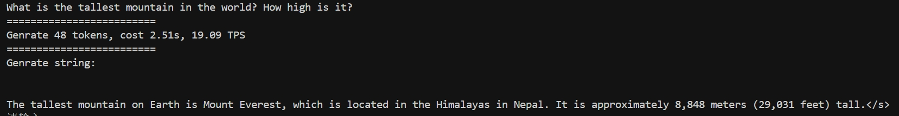
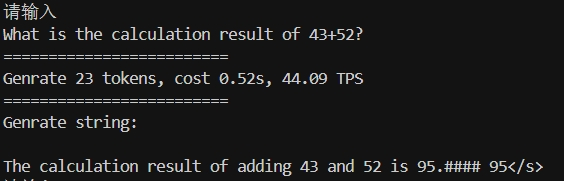

## 目录

- [更新日志](#0)
- [模型下载](#1)
- [快速上手](#2)
- [开源社区](#community)
- [评测结果](#3)
- [手机部署](#4)
- [Demo & API 部署](#5)
- [二次开发](#6)
- [开源协议](#7)
- [工作引用](#8)
- [典型示例](#9)

<p id="0"></p>

## 更新日志
- **2024/04/11 开源[HARE-V-2.0](https://huggingface.co/openbmb/HARE-V-2.0)、[HARE-1.1B-128k](https://huggingface.co/openbmb/HARE-1.1B-128k)、[HARE-MoE-8x2B](https://huggingface.co/openbmb/HARE-MoE-8x2B)和[HARE-1B](https://huggingface.co/openbmb/HARE-1B-sft-bf16)！点击[这里](https://openbmb.vercel.app/?category=Chinese+Blog)查看技术博客。** 

<p id="1"></p>

## 模型下载

* 语言模型
  注: 更多模型版本见[这里](https://huggingface.co/collections/openbmb/minicpm-2b-65d48bf958302b9fd25b698f)。


<p id="2"></p>

## 快速上手

#### 在线体验

- [内网体验@金斌](https://colab.research.google.com/drive/1tJcfPyWGWA5HezO7GKLeyeIso0HyOc0l?usp=sharing)


#### HARE-1.1B 模型调用样例
* 安装`transformers>=4.36.0`以及`accelerate`后，运行以下代码
```python
import torch

from transformers import AutoTokenizer, AutoModelForCausalLM

device = "cuda" if torch.cuda.is_available() else "cpu"

model_path = "/lite-ai/HARE-1.1B"
tokenizer = AutoTokenizer.from_pretrained(model_path)
model = AutoModelForCausalLM.from_pretrained(model_path).to(device)

prompt = """What is the tallest mountain in the world? How high is it?"""
tokens = tokenizer(prompt, add_special_tokens=True, return_tensors='pt').to(device)
output = model.generate(**tokens)

output_tokens = output[0].cpu().numpy()[tokens.input_ids.size()[1]:]
output_string = tokenizer.decode(output_tokens)
print(output_string)
```

#### 模型训练
* 下载数据集及数据配置
```shell
```
* 运行指令
```shell
```

#### 量化 Auto_GPTQ
* 量化脚本
```shell
cd ./inference/scripts/auto_gptq
python3 quantify.py

```
* 加载量化模型&使用脚本
```python
import torch

from auto_gptq import AutoGPTQForCausalLM
from transformers import AutoTokenizer, TextGenerationPipeline

device = "cuda:0" if torch.cuda.is_available() else "cpu"
model_path = "quantized_model_path"

model = AutoGPTQForCausalLM.from_quantized(model_path, device=device)
tokenizer = AutoTokenizer.from_pretrained(model_path)

query = "What is the tallest mountain in the world? How high is it?"
# inference with model.generate
print(tokenizer.decode(model.generate(**tokenizer(query, return_tensors="pt").to(model.device))[0]))

# or you can also use pipeline
pipeline = TextGenerationPipeline(model=model, tokenizer=tokenizer)
print(pipeline(query)[0]["generated_text"])
```

<p id="llamaformat"></p>


#### vLLM 加速推理

* vLLM 加速推理[vLLM](https://github.com/vllm-project/vllm)
```shell
pip install vllm
```

* 使用vllm进行推理
```python
from vllm import LLM, SamplingParams
from transformers import AutoTokenizer

model_path = "your_model_path"
llm = LLM(model=model_path, trust_remote_code=True, tensor_parallel_size=4)

query = "What is the tallest mountain in the world? How high is it?"
sampling_params = SamplingParams(temperature=0.8, top_p=0.95, max_tokens=64)
outputs = llm.generate(query, sampling_params)
print(outputs)
```

* 测试输出
```shell
<用户>: What is the tallest mountain in the world? How high is it?
<AI>:
 The tallest mountain on Earth is Mount Everest, which is located in the Himalayas in Nepal. It is approximately 8,848 meters (29,031 feet) tall.
```

#### llama.cpp
1. 下载项目
```shell
git clone https://github.com/ggerganov/llama.cpp
cd llama.cpp
```
2. [安装llama.cpp](https://github.com/ggerganov/llama.cpp?tab=readme-ov-file#build)
```
make
```

3. 获取GUFF格式模型 
* 下载gguf格式的模型。[下载链接-fp16格式](https://huggingface.co/runfuture/HARE-1.1B-dpo-fp16-gguf) [下载链接-q4km格式](https://huggingface.co/runfuture/HARE-1.1B-dpo-q4km-gguf)
* SafeTensor转化为GUFF
```
python3 convert.py /models/safetensor-25000/
```
* 量化模型
```
./quantize /models/safetensor-25000/safetensor-25000-1B-F32.gguf /models/safetensor-25000/safetensor-25000-1B-Q8_0.gguf Q8_0
```

4. 在命令行运行对话交流模式示例代码:
```
 ./main -m  /path/safetensor025B-26500/safetensor025B-26500-254M-F32.gguf -n 128 --color -f prompts/alpaca.txt -ins -c 2048 --temp 0.2 -n 256
```
更多参数调整[详见](https://github.com/ggerganov/llama.cpp/blob/master/examples/main/README.md)

## fp8训练
依赖transformer_engine镜像运行
* 拉取镜像
```shell
docker pull nvcr.io/nvidia/pytorch:23.10-py3
```
* 启动docker
``` 
docker run --gpus all -it --name fp8-mistral nvcr.io/nvidia/pytorch:23.10-py3 /bin/bash
```
* 运行fp8训练
```shell
cd ./model
deepspeed --include='localhost:0,1,2,3,4,5,6,7' --master_port 9007 train.py ./train_args/train_config_fp8.json 
```

<p id="community"></p>
## 开源社区

- [ChatLLM框架](https://github.com/foldl/chatllm.cpp)：[在CPU上跑HARE](https://huggingface.co/openbmb/HARE-1.1B-dpo-bf16/discussions/2#65c59c4f27b8c11e43fc8796)


<p id="3"></p>

## 评测结果

#### 评测设置


#### 部署模式


#### 评测度量


#### 文本模型评测


#### HARE-1.1B模型评测

* 我们自己评测了正式开源的模型权重。

## 手机部署
### 部署步骤
* 基于Linux系统，使用MLC-LL开源框架将模型部署在手机（以Android为例，参考知乎教程：https://zhuanlan.zhihu.com/p/688232510。更多端侧设备可参考MLC-LL官网（https://llm.mlc.ai/））
1. 创建并激活python虚拟环境，建议python版本为3.10及以上。
```
conda create -n your-environment python==3.11
conda activate your-environment
```
2. 安装Rust。
* Rust需要将HuggingFace标记器交叉编译到Android。确保在$PATH中提供rustc、cargo和rustup
```
curl --proto '=https' --tlsv1.2 -sSf https://sh.rustup.rs | sh
```
* 安装完成后，可以在命令行输入一下命令检验是否安装成功，如果没有结果，则表示安装失败，可以尝试重新安装。
```
rustc --version
```
3. 安装Android Studio进行apk的打包。
* 在Android Studio官网中下载 ，将tar.gz文件解压到对应的目录即可。运行以下命令即可开始通过图形化界面使用Android Studio。
```
./bin/studio.sh
```
* 在 Android Studio 依次点击“File → Settings → Languages & Frameworks → Android SDK → SDK Tools”，选择安装NDK、CMake和Android SDK Platform-Tools。安装完成后，在环境变量中去对NDK等进行配置。
* 下面是安装完毕之后需要配置的环境变量，可以执行 vim ~/.bashrc 命令，之后在最下面粘贴即下面内容即可：
```
export ANDROID_NDK=/home/User/Android/Sdk/ndk/27.0.11718014
export ANDROID_HOME=/home/User/Android/Sdk
export PATH=$PATH:/home/User/Android/Sdk/cmake/3.22.1/bin
export PATH=$PATH:/home/User/Android/Sdk/platform-tools
export TVM_NDK_CC=$ANDROID_NDK/toolchains/llvm/prebuilt/linux-x86_64/bin/aarch64-linux-android24-clang
export TVM_HOME=/home/User/mlc-llm/3rdparty/tvm  # 配置TVM Unity runtime
export TVM_HOME=$TVM_HOME/include/tvm/runtime
source $HOME/.cargo/env # Rust
```
注意：上面的路径需要和自己环境中安装的路径一致。

4. 安装openjdk，官方要求的版本是>17。
```
# 更新update
sudo apt update
# 安装openjdk17
sudo apt install openjdk-17-jdk 
# 查看jdk17的安装路径
sudo update-alternatives --list java
# 用上面命令获取的路径，编入到bashrc文件的最后一行中
vi ~/.bashrc
# 将下面的命令，编入到bashrc文件的最后一行中
export JAVA_HOME=/usr/lib/jvm/java-17-openjdk-amd64/bin/java
# 更新环境变量
source ~/.bashrc
```
5. 安装TVM Unity compiler，用来对模型进行编译
```
conda activate your-environment
python -m pip install --pre -U -f https://mlc.ai/wheels mlc-ai-nightly
```
* 以下命令可以帮助确认 TVM 是否已正确安装为 python 包，并提供 TVM python 包的安装位置。
```
python -c "import tvm; print(tvm.__file__)"
```
6. 安装MLC-LLM。如果安装了TVM Unity compiler后，依旧找不到mlc_llm命令，则需要安装MLC-LLM包进行编译。
```
	python3 -m pip install --pre -U -f https://mlc.ai/wheels mlc-llm-nightly mlc-ai-nightly
```
* 安装完成测试mlc_llm命令：
```
>>> mlc_llm --help
usage: MLC LLM Command Line Interface. [-h]{compile,convert_weight,gen_config,chat,serve,bench}
positional arguments: {compile,convert_weight,gen_config,chat,serve,bench} Subcommand to to run. (choices: compile,convert_weight, gen_config, chat, serve, bench)
options: -h, --help show this help message and exit
```
7. 编译需要部署至Android的模型，建议详细参考MLC-LLM的教程。MODEL_NAME这个变量就是你，QUANTIZATION就是默认的q4f16_1，后面的
	MODEL_NAME=gzdx_sft  # 模型的目录名
	QUANTIZATION=q4f16_1  # 量化方式
```
# convert weights
mlc_llm convert_weight ./dist/models/$MODEL_NAME/ --quantization $QUANTIZATION -o dist/$MODEL_NAME-$QUANTIZATION-MLC/  # dist/MODEL_NAME-QUANTIZATION-MLC/是保存编译之后的文件目录名

# create mlc-chat-config.json
mlc_llm gen_config ./dist/models/$MODEL_NAME/ --quantization $QUANTIZATION --conv-template mistral_default -o dist/${MODEL_NAME}-${QUANTIZATION}-MLC/

# compile: compile model library with specification in mlc-chat-config.json
mlc_llm compile ./dist/${MODEL_NAME}-${QUANTIZATION}-MLC/mlc-chat-config.json --device android -o ./dist/${MODEL_NAME}-${QUANTIZATION}-MLC/${MODEL_NAME}-${QUANTIZATION}-android.tar
```
* 执行以上命令，运行完成之后在./dist/$MODEL_NAME-$QUANTIZATION-MLC这个目录下得到了所需的编译后文件。
8. 用编译后的模型构建安卓工程。先进入目录，打开应用设置文件：
```
cd ./android/library
vim ./src/main/assets/app-config.json
```
* 会看到有两个属性：model_list和model_lib_path_for_prepare_libs，具体介绍见MLC-LLM官网。model_lib_path_for_prepare_libs这个属性是用来获取模型对应的Model lib，也就是使用移动的GPU的编译库，对应的是刚刚获得android.tar的那个位置。这里给出很多个模型的预设，全部删掉，只重新填写自己编译的模型信息即可。完成之后，运行：
```
./prepare_libs.sh
```
会生成两个文件：
```
>>> find ./build/output -type f
./build/output/arm64-v8a/libtvm4j_runtime_packed.so
./build/output/tvm4j_core.jar
```
9. 构建安卓应用。启动Android Studio：将./android文件作为Android studio 项目打开，将Android设备连接到虚拟机，并在手机设置的开发者模式中启用“USB 调试”。在Android Studio的菜单栏中，单击“Build → Make Project”。构建完成后，单击“Run → Run 'app'”，这时候你的手机会自动安装MLCChat这个软件。
10. 注入权重。运行以下命令之前需要将{MODEL_NAME}和替换{QUANTIZATION}为实际模型名称（例如 gzdx_sft-q4f16_1）和量化方式（例如 q4f16_1）。
```
# 将apk安装进你的android手机
adb install android/MLCChat/app/release/app-release.apk
# 将模型权重文件上传至android手机的临时文件夹
adb push dist/gzdx_sft-q4f16_1-MLC /data/local/tmp/gzdx_sft-q4f16_1/
# 在android手机上创建apk读取本地模型的文件夹路径
adb shell "mkdir -p /storage/emulated/0/Android/data/ai.mlc.mlcchat/files/"
# 将模型拷贝至apk读取文件夹路径
adb shell "mv /data/local/tmp/gzdx_sft-q4f16_1 /storage/emulated/0/Android/data/ai.mlc.mlcchat/files/"
```
如果你到这里都没有遇到错误，那么你将在可以手机上成功地运行模型了。


#### 部署性能

* 我们未针对手机推理模型进行深度优化和系统测试，仅验证HARE使用手机芯片进行推理的可行性。**欢迎更多开发者进一步调优并更新下面的测试列表，不断提升轻量大模型在手机上的推理性能**。
手机测评
* 我们也使用MLC-LLM验证了在手机上部署HARE-1.1B模型的可行性，能够正常输入输出，但也存在处理时间较长的问题，需要进一步优化，兼容性问题也需要进一步解决。下面的动图是使用小米k40 运行HARE-1.1B的屏幕录像，没有进行任何编辑。
@吴明勇 待补充
<table align="center">
    <p align="center">
      
      
    </p>
</table>


<p id="5"></p>

## Demo & API 部署

#### 基于Gradio的网页版Demo
@金斌补充
* 使用如下命令启动基于Gradio的网页版demo：
```shell
```

<p id="6"></p>

## 二次开发
@金斌补充
```
```
<p id="9"></p>

## 典型示例

#### 文本生成



#### 代码生成


#### 数理逻辑



#### 文本翻译


#### 指令跟随


#### 特殊字符


<p id="7"></p>

## 开源协议

#### 模型协议


#### 声明

<p id="8"></p>

## 工作引用

* 如果觉得HARE有助于您的工作，请引用我们的[论文](https://arxiv.org/abs/2404.06395)

```
@article{hu2024minicpm,
  title={HARE: Unveiling the Potential of Small Language Models with Scalable Training Strategies},
  author={Hu, Shengding and Tu, Yuge and Han, Xu and He, Chaoqun and Cui, Ganqu and Long, Xiang and Zheng, Zhi and Fang, Yewei and Huang, Yuxiang and Zhao, Weilin and others},
  journal={arXiv preprint arXiv:2404.06395},
  year={2024}
}
```
